## Table of Contents

  * [基本概念](#基本概念)
     * [SQL](#sql)
     * [数据库](#数据库)
  * [数据库类型](#数据库类型)
     * [关系型数据库](#关系型数据库)
        * [概念](#概念)
        * [举例](#举例)
        * [优点](#优点)
        * [缺点](#缺点)
     * [非关系型数据库](#非关系型数据库)
        * [概念](#概念-1)
        * [举例](#举例-1)
        * [优点](#优点-1)
        * [缺点](#缺点-1)
  * [MySQL学习](#mysql学习)
     * [数据类型](#数据类型)
        * [数值类型](#数值类型)
        * [日期和时间类型](#日期和时间类型)
        * [字符串类型](#字符串类型)
     * [基础语法](#基础语法)
        * [对数据库的操作](#对数据库的操作)
        * [对数据表的操作](#对数据表的操作)
           * [创建数据表](#创建数据表)
           * [插入数据](#插入数据)
           * [查询数据](#查询数据)
              * [LIMIT 属性](#limit-属性)
              * [WHERE 子句](#where-子句)
              * [UNION 操作符](#union-操作符)
              * [ORDER BY 子句](#order-by-子句)
           * [更新数据](#更新数据)
           * [删除数据](#删除数据)
  * [参考资料](#参考资料)

------


## 基本概念

### SQL

用于管理关系数据库系统（RDBMS）的**语言**，可进行增、删、改、查等操作。

### 数据库

**数据库**（Database），是按照数据结构来组织、存储和管理数据的仓库。平时可能会与**数据库管理系统**（DBMS）混淆，DBMS 是我们所使用的软件，他们两者的关系为：使用 DBMS ，访问数据库。

----

## 数据库类型

### 关系型数据库

#### 概念

采用关系模型（二维表格模型）来组织数据，其以行和列的形式存储数据。

#### 举例

MySQL、Oracle、MariaDB、SQLite、PostgreSQL、SQL Server。

#### 优点

1 易于维护：都是使用表结构，格式一致；
2 使用方便：SQL语言通用，可用于复杂查询；
3 复杂操作：支持SQL，可用于一个表以及多个表之间非常复杂的查询。

#### 缺点

1 读写性能比较差，尤其是海量数据的高效率读写；
2 固定的表结构，灵活度稍欠；
3 高并发读写需求，传统关系型数据库来说，硬盘I/O是一个很大的瓶颈。


### 非关系型数据库

#### 概念

指非关系型、分布式、不提供ACID (数据库事务处理的四个基本要素) 的数据库设计模式。

#### 举例

MongoDB、Redis、HBase、CouchDB。

#### 优点

1 格式灵活：存储数据的格式可以是 key,value 形式、文档形式、图片形式等等，使用灵活，应用场景广泛，而关系型数据库则只支持基础类型。
2 速度快：nosql可以使用硬盘或者随机存储器作为载体，而关系型数据库只能使用硬盘；
3 高扩展性；
4 成本低：nosql数据库部署简单，基本都是开源软件。

#### 缺点

1 不提供sql支持，学习和使用成本较高；
2 无事务处理；
3 数据结构相对复杂，复杂查询方面稍欠。

----

## MySQL学习

### 数据类型

MySQL  的数据类型大致可分为三类：数值、日期/时间和字符串。

#### 数值类型

| 类型         | 大小                                     | 范围（有符号）                                               | 范围（无符号）                                               | 用途            |
| :----------- | :--------------------------------------- | :----------------------------------------------------------- | :----------------------------------------------------------- | :-------------- |
| TINYINT      | 1 字节                                   | (-128，127)                                                  | (0，255)                                                     | 小整数值        |
| SMALLINT     | 2 字节                                   | (-32 768，32 767)                                            | (0，65 535)                                                  | 大整数值        |
| MEDIUMINT    | 3 字节                                   | (-8 388 608，8 388 607)                                      | (0，16 777 215)                                              | 大整数值        |
| INT或INTEGER | 4 字节                                   | (-2 147 483 648，2 147 483 647)                              | (0，4 294 967 295)                                           | 大整数值        |
| BIGINT       | 8 字节                                   | (-9,223,372,036,854,775,808，9 223 372 036 854 775 807)      | (0，18 446 744 073 709 551 615)                              | 极大整数值      |
| FLOAT        | 4 字节                                   | (-3.402 823 466 E+38，-1.175 494 351 E-38)，0，(1.175 494 351 E-38，3.402 823 466 351 E+38) | 0，(1.175 494 351 E-38，3.402 823 466 E+38)                  | 单精度 浮点数值 |
| DOUBLE       | 8 字节                                   | (-1.797 693 134 862 315 7 E+308，-2.225 073 858 507 201 4 E-308)，0，(2.225 073 858 507 201 4 E-308，1.797 693 134 862 315 7 E+308) | 0，(2.225 073 858 507 201 4 E-308，1.797 693 134 862 315 7 E+308) | 双精度 浮点数值 |
| DECIMAL      | 对DECIMAL(M,D) ，如果M>D，为M+2否则为D+2 | 依赖于M和D的值                                               | 依赖于M和D的值                                               | 小数值          |

#### 日期和时间类型

| 类型      | 大小 (字节) | 范围                                                         | 格式                | 用途                     |
| :-------- | :---------- | :----------------------------------------------------------- | :------------------ | :----------------------- |
| DATE      | 3           | 1000-01-01/9999-12-31                                        | YYYY-MM-DD          | 日期值                   |
| TIME      | 3           | '-838:59:59'/'838:59:59'                                     | HH:MM:SS            | 时间值或持续时间         |
| YEAR      | 1           | 1901/2155                                                    | YYYY                | 年份值                   |
| DATETIME  | 8           | 1000-01-01 00:00:00/9999-12-31 23:59:59                      | YYYY-MM-DD HH:MM:SS | 混合日期和时间值         |
| TIMESTAMP | 4           | 1970-01-01 00:00:00/2038结束时间是第 **2147483647** 秒，北京时间 **2038-1-19 11:14:07**，格林尼治时间 2038年1月19日 凌晨 03:14:07 | YYYYMMDD HHMMSS     | 混合日期和时间值，时间戳 |

#### 字符串类型

| 类型       | 大小                | 用途                            |
| :--------- | :------------------ | :------------------------------ |
| CHAR       | 0-255字节           | 定长字符串                      |
| VARCHAR    | 0-65535 字节        | 变长字符串                      |
| TINYBLOB   | 0-255字节           | 不超过 255 个字符的二进制字符串 |
| TINYTEXT   | 0-255字节           | 短文本字符串                    |
| BLOB       | 0-65 535字节        | 二进制形式的长文本数据          |
| TEXT       | 0-65 535字节        | 长文本数据                      |
| MEDIUMBLOB | 0-16 777 215字节    | 二进制形式的中等长度文本数据    |
| MEDIUMTEXT | 0-16 777 215字节    | 中等长度文本数据                |
| LONGBLOB   | 0-4 294 967 295字节 | 二进制形式的极大文本数据        |
| LONGTEXT   | 0-4 294 967 295字节 | 极大文本数据                    |

### 基础语法

#### 对数据库的操作

```mysql
show databases;   # 显示所有数据库
show tables from mysql;   # 显示 mysql 库中的所有表
create database test;   # 创建 test 数据库
drop database test;   # 删除 test 数据库
use week2;   # 选择 week2 数据库
```

#### 对数据表的操作

##### 创建数据表

```mysql
create table `admin`(
`id` int unsigned not null auto_increment,
`username` varchar(20) not null unique,
`password` varchar(50) not null,
`email` varchar(30) not null unique,
`date` datetime default current_timestamp,
primary key(`id`)
)ENGINE=InnoDB DEFAULT CHARSET=utf8;
```

> **PRIMARY KEY** 主键是唯一的，且不允许 NULL 值，每个表只能有一个 PRIMARY KEY 约束。
>
> **UNIQUE** 约束唯一标识数据库表中的每条记录，可为 NULL ，每个表可以有多个 UNIQUE 约束。
>
> **AUTO_INCREMENT**  自动增量，每个表只允许一个AUTO_INCREMENT列，而且它必须被索引。
>
> **NOT NULL** 不允许 NULL 值，插入或更新数据时，该列必须有值。它与空串不同，空串是有效的值。
>
> **数据库引擎**：
>
> **InnoDB** 是一个可靠的事务处理引擎，它不支持全文 本搜索； 
>
> **MEMORY** 在功能等同于MyISAM，但由于数据存储在内存 中，速度很快（特别适合于临时表）； 
>
> **MyISAM** 是一个性能极高的引擎，它支持全文本搜索， 但不支持事务处理。


##### 插入数据

```mysql
insert into admin 
(username,password,email)
values
('admin',md5('fdsaff!;fsdg45'),'exam121@qq.com'),
('droplet',md5('46hh@23j-_40!'),'432555@163.com'),
('Tom',md5('45jytk;fa=$c54'),'Tom886@gmail.com');
```

##### 查询数据

```mysql
select * from admin;
```

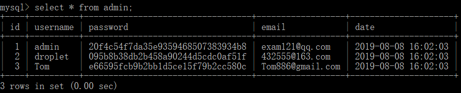

```mysql
select username,password from admin;
```

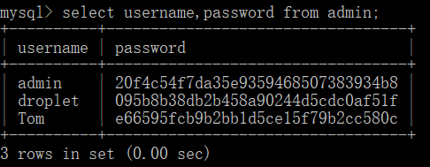 

###### LIMIT 属性

设定返回的记录数

```mysql
select username,password from admin limit 0,2;   # 从0开始，取2条
```

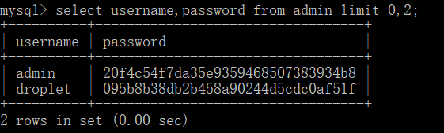 

###### WHERE 子句 

有条件地选取数据。

- 可以使用 AND 或者 OR 指定一个或多个条件。
- WHERE 子句也可以运用于 SQL 的 DELETE 或者 UPDATE 命令。

```mysql
select username,password from admin where id=1;
select * from admin where id=1 and username='admin';
select * from admin where id=1 or id=2;
```

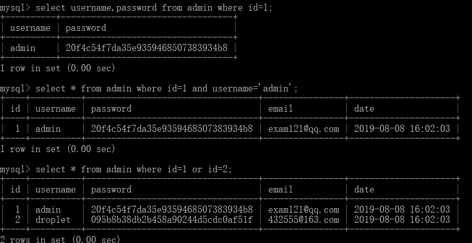

###### UNION 操作符

UNION 操作符用于连接两个以上的 SELECT 语句的结果组合到一个结果集合中。

先另外创建一个表

```mysql
create table `user`(
`id` int unsigned not null auto_increment,
`username` varchar(20) not null unique,
`password` varchar(50) not null,
`email` varchar(30) not null unique,
`date` datetime default current_timestamp,
primary key(`id`)
)ENGINE=InnoDB DEFAULT CHARSET=utf8;

insert into user 
(username,password,email)
values
('Tony',md5('gdffgfd45'),'Tony121@hotmail.com'),
('Jerry',md5('4gfdgdf40'),'Jerry233@yahoo.com'),
('George',md5('45jytgdgc54'),'George886@outlook.com');
```

`admin` 表数据

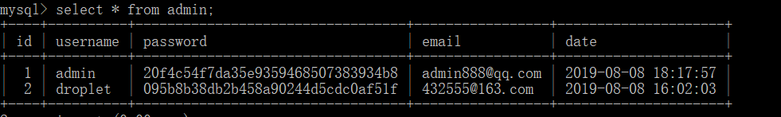

`user` 表数据

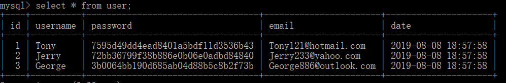

使用 UNION 操作符

```mysql
select username from admin
union all
select username from user;
```

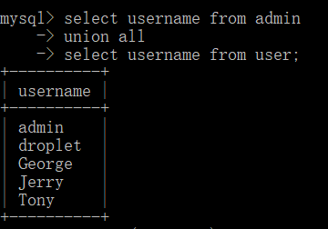 

UNION 前面的语句查询不到数据时，后面的语句仍会继续执行

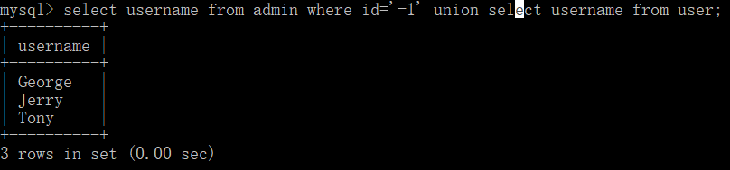

###### ORDER BY 子句

使用 ORDER BY 子句来设定按哪个字段哪种方式来进行排序，再返回搜索结果。

```mysql
select * from user order by username asc;   # asc 为升序，desc 为降序。
```

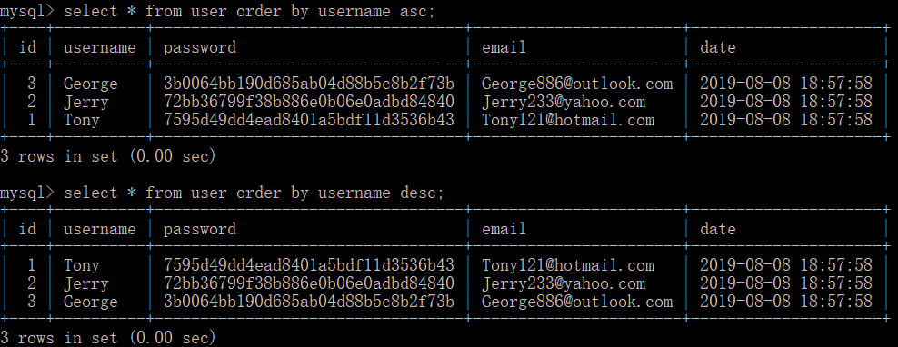

##### 更新数据

修改数据时使用 UPDATE 命令

```mysql
update admin set email='admin888@qq.com',date=now() where username='admin';
```

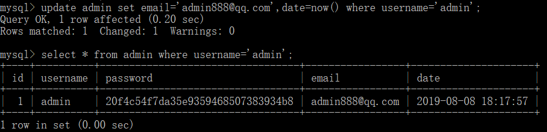


##### 删除数据

使用DELETE FROM 命令来删除数据表中的记录。

```mysql
delete from admin where username='Tom';
```

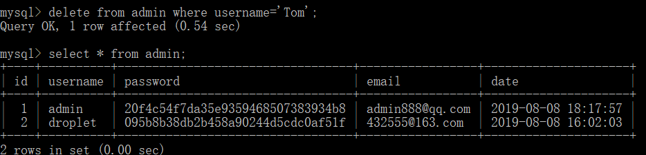

----

## 参考资料

https://blog.csdn.net/aaronthon/article/details/81714528

https://www.runoob.com/mysql/mysql-tutorial.html