[TOC]


------


#### 环境搭建

CentOS 7 

Nginx  1.16.0

PHP  7.3.7

MySQL  8.0.17


###### 一、安装Nginx

1、安装依赖

```
yum -y install gcc gcc-c++ make automake autoconf pcre pcre-devel zlib zlib-devel openssl openssl-devel libtool
```


2、下载 Nginx 包 

```
cd /usr/local/src
wget http://nginx.org/download/nginx-1.16.0.tar.gz
```


3、解压 

```
tar -zxvf nginx-1.16.0.tar.gz
```


3、创建用户及用户组

```
groupadd -r www
useradd -r -g www www
```


4、配置

```
cd nginx-1.16.0
./configure \
--prefix=/usr/local/nginx \
--sbin-path=/usr/local/nginx/sbin/nginx \
--conf-path=/usr/local/nginx/conf/nginx.conf \
--error-log-path=/var/log/nginx/error.log  \
--http-log-path=/var/log/nginx/access.log \
--pid-path=/var/run/nginx/nginx.pid \
--lock-path=/var/lock/nginx.lock \
--user=www \
--group=www \
--with-http_ssl_module \
--with-http_stub_status_module \
--with-http_gzip_static_module \
--http-client-body-temp-path=/var/tmp/nginx/client/ \
--http-proxy-temp-path=/var/tmp/nginx/proxy/ \
--http-fastcgi-temp-path=/var/tmp/nginx/fcgi/ \
--http-uwsgi-temp-path=/var/tmp/nginx/uwsgi \
--http-scgi-temp-path=/var/tmp/nginx/scgi \
--with-pcre
```


5、编译安装

```
make && make install
```


6、启动 Nginx 服务

```
/usr/local/nginx/sbin/nginx 
```

这时提示

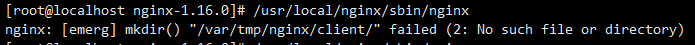

没有这个文件夹，手动创建一个

```
mkdir /var/tmp/nginx
mkdir /var/tmp/nginx/client
```


再次启动 `/usr/local/nginx/sbin/nginx `

查看进程，是否成功开启

```
ps aux | grep nginx
```

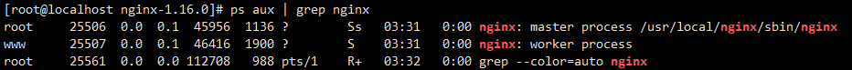

但这时打开浏览器并无法访问，原因是防火墙开启，

先停止防火墙

```
systemctl stop firewalld
```


再次访问成功了

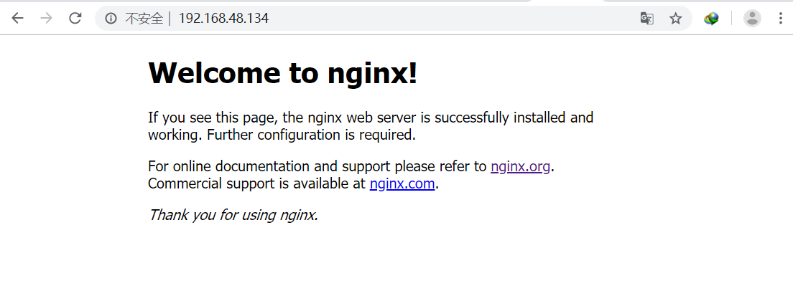

7、设置软链接，方便执行命令

```
ln -sf /usr/local/nginx/sbin/nginx /usr/sbin
```

这样就可以输入 `nginx` 执行相关命令了

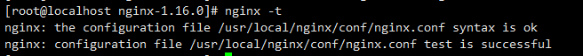


8、其他问题

在虚拟机重启后，启动 nginx 会出现这个问题

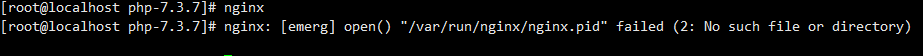

这是由于每次虚拟机重启后都会删除 `/var/run/nginx` 这个文件夹


解决方法：

```
mkdir /var/run/nginx
vi /usr/local/nginx/conf/nginx.conf 
```

把 # 去掉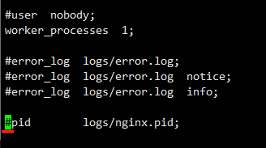


然后：

```
mkdir /usr/local/nginx/logs
cp /var/run/nginx/nginx.pid /usr/local/nginx/logs
cp -r /usr/local/nginx/logs /usr/local/nginx/conf/
chmod 755 /usr/local/nginx/conf/logs/
chmod 755 /usr/local/nginx/conf/logs/nginx.pid

nginx -s reload
```


参考资料：

https://www.cnblogs.com/sunshineliulu/p/8991957.html

https://www.cnblogs.com/herui1991/p/8996917.html

https://blog.csdn.net/zyhlearnjava/article/details/71932719


###### 二、安装MySQL

1、下载、解压

```
cd /usr/local
wget https://dev.mysql.com/get/Downloads/MySQL-8.0/mysql-8.0.17-linux-glibc2.12-x86_64.tar.xz

tar -xvf mysql-8.0.17-linux-glibc2.12-x86_64.tar.xz
```


2、创建 `mysql` 目录，复制文件过去

```
mkdir mysql
cp -r mysql-8.0.17-linux-glibc2.12-x86_64/* mysql
```


3、创建用户和用户组

```
groupadd mysql
useradd -r -g mysql -s /bin/false   # 创建不能登录的mysql用户，不能使用系统其他服务
```


4、进入 `mysql` 目录，初始化相关设定

```
cd mysql
mkdir log
mkdir mysql-files
chown mysql:mysql mysql-files
chmod 750 mysql-files
chown -R mysql:mysql .
bin/mysqld --initialize --user=mysql
bin/mysql_ssl_rsa_setup
bin/mysqld_safe --user=mysql &

cp support-files/mysql.server /etc/init.d/mysql.server   # 启动脚本
```


 5、添加环境变量

```
echo "export PATH=$PATH:/usr/local/mysql/bin"  >>  /etc/profile
source /etc/profile
```


6、配置文件

`vi /etc/my.cnf`

```
[mysqld]
port=3306
basedir=/usr/local/mysql
datadir=/usr/local/mysql/data
log-error=/usr/local/mysql/log/mysql-err.log
user=mysql

skip-grant-tables  #此项是为了装好后免登陆修改密码使用

default_authentication_plugin=mysql_native_password 

[client]
socket=/tmp/mysql.sock
```


6、编辑启动脚本

`vi /etc/init.d/mysql.server`

```
basedir=/usr/local/mysql
datadir=/usr/local/mysql/data
```


7、启动MySQL

`ln -s /etc/init.d/mysql.server /usr/sbin`

`mysql.server start`


8、修改密码

`mysql -uroot -p`

要求输入密码时直接回车即可

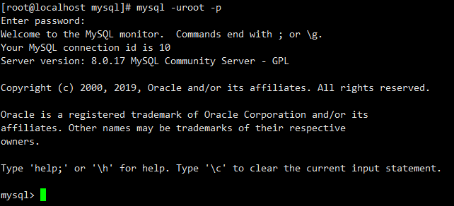


先清空root密码

`mysql>update user set authentication_string = '' where user = 'root';`

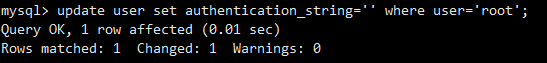

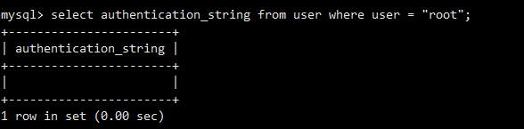


删掉 `/etc/my.cnf` 里的 `skip-grant-tables`


重启 mysql

`/etc/init.d/mysql.server restart`


登录

```
[root@localhost mysql]# mysql -uroot -p
Enter password: 回车
```


修改密码

```
alter user 'root'@'localhost' identified by '新密码' password expire never;
flush privileges;
```

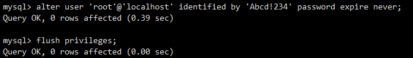


修改登录IP限制，允许外部连接

```
update user set host = '%' where user = 'root';
```

使用远程工具连接

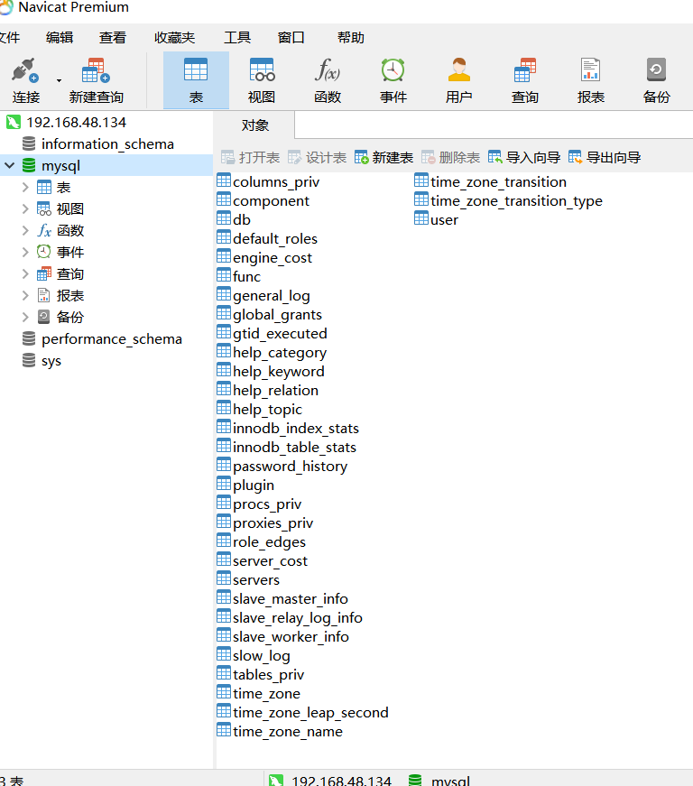


参考资料：

https://blog.csdn.net/u013246891/article/details/81747639

https://dev.mysql.com/doc/refman/8.0/en/binary-installation.html

https://dev.mysql.com/doc/refman/8.0/en/data-directory-initialization.html


###### 三、安装 PHP

1、安装依赖

```
yum install gcc-c++ libzip libzip-devel libxml2 libxml2-devel openssl openssl-devel bzip2 bzip2-devel libcurl libcurl-devel libjpeg libjpeg-devel libpng libpng-devel freetype freetype-devel gmp gmp-devel libmcrypt libmcrypt-devel readline readline-devel libxslt libxslt-devel
```

这是显示：No package libmcrypt available

解决方法

```
yum install epel-release   // 扩展包更新包
```


2、下载、解压 PHP

```
cd /usr/local/src
wget https://www.php.net/distributions/php-7.3.7.tar.xz
tar -xvf php-7.3.7.tar.xz
```


3、编译安装

```
./configure \
--prefix=/usr/local/php \
--with-config-file-path=/etc \
--enable-fpm \
--with-fpm-user=www \
--with-fpm-group=www \
--enable-inline-optimization \
--disable-debug \
--disable-rpath \
--enable-shared \
--enable-soap \
--with-libxml-dir \
--with-xmlrpc \
--with-openssl \
--with-mcrypt \
--with-mhash \
--with-pcre-regex \
--with-sqlite3 \
--with-zlib \
--enable-bcmath \
--with-iconv \
--with-bz2 \
--enable-calendar \
--with-curl \
--with-cdb \
--enable-dom \
--enable-exif \
--enable-fileinfo \
--enable-filter \
--with-pcre-dir \
--enable-ftp \
--with-gd \
--with-openssl-dir \
--with-jpeg-dir \
--with-png-dir \
--with-zlib-dir \
--with-freetype-dir \
--enable-gd-native-ttf \
--enable-gd-jis-conv \
--with-gettext \
--with-gmp \
--with-mhash \
--enable-json \
--enable-mbstring \
--enable-mbregex \
--enable-mbregex-backtrack \
--with-libmbfl \
--with-onig \
--enable-pdo \
--with-mysqli=mysqlnd \
--with-pdo-mysql=mysqlnd \
--with-zlib-dir \
--with-pdo-sqlite \
--with-readline \
--enable-session \
--enable-shmop \
--enable-simplexml \
--enable-sockets \
--enable-sysvmsg \
--enable-sysvsem \
--enable-sysvshm \
--enable-wddx \
--with-libxml-dir \
--with-xsl \
--enable-zip \
--enable-mysqlnd-compression-support \
--with-pear \
--enable-opcache

make && make install
```

出现 `checking for libzip... configure: error: system libzip must be upgraded to version >= 0.11`

libzip的版本过小，

解决方法

```
yum remove libzip libzip-devel

yum install http://rpms.remirepo.net/enterprise/7/remi/x86_64//libzip5-1.5.2-1.el7.remi.x86_64.rpm

yum install http://rpms.remirepo.net/enterprise/7/remi/x86_64//libzip5-devel-1.5.2-1.el7.remi.x86_64.rpm
```

参考：http://amon.org/libzip


4、创建配置文件

```
cp php.ini-development /etc/php.ini
cp /usr/local/php/etc/php-fpm.conf.default /usr/local/php/etc/php-fpm.conf
vi /usr/local/php/etc/php-fpm.conf
修改
pid = /usr/local/php/var/run/php-fpm.pid
```


5、启动 php-fpm

`/usr/local/php/sbin/php-fpm`

创建软链接

` ln -sf /usr/local/php/sbin/php-fpm /usr/sbin`


6、配置 Nginx使其支持.php

`vim /usr/local/nginx/conf/nginx.conf`

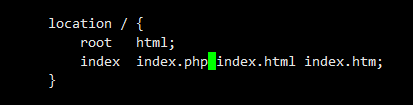

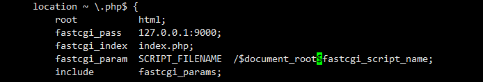


```
echo "<?php phpinfo(); ?>" >> /usr/local/nginx/html/phpinfo.php
nginx -s reload
```

浏览器访问

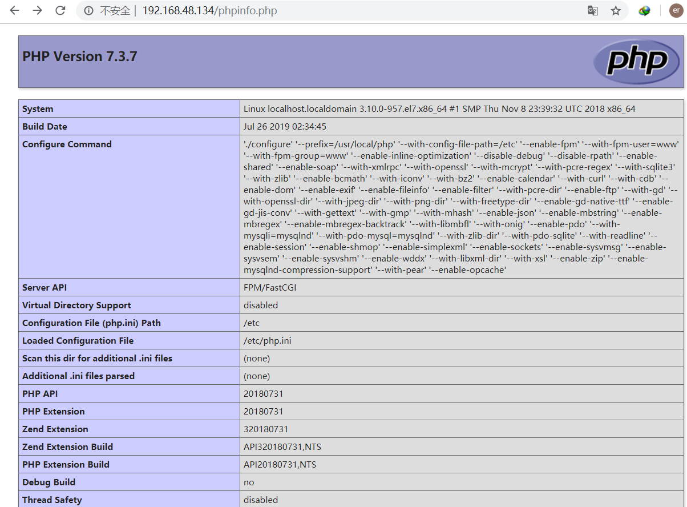


连接 MySQL测试：

修改index.php内容

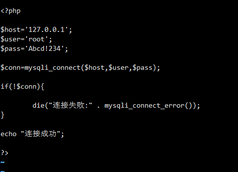


打开浏览器访问，会出现

The server requested authentication method unknown to the client


解决方法：

登录mysql 后

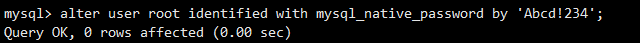


再次访问


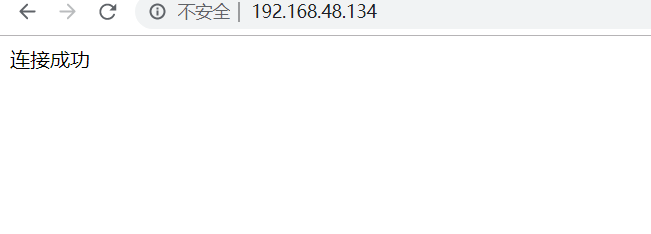

查询数据：

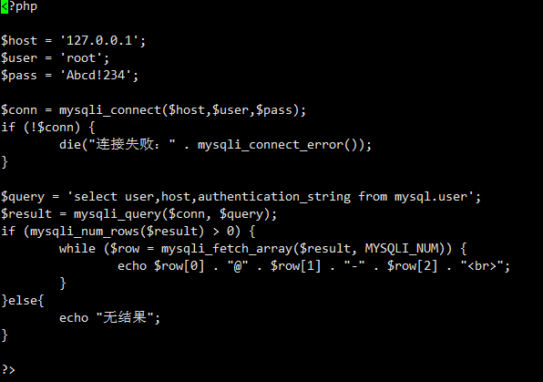


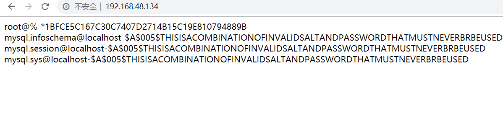


最后，安装bWAPP测试

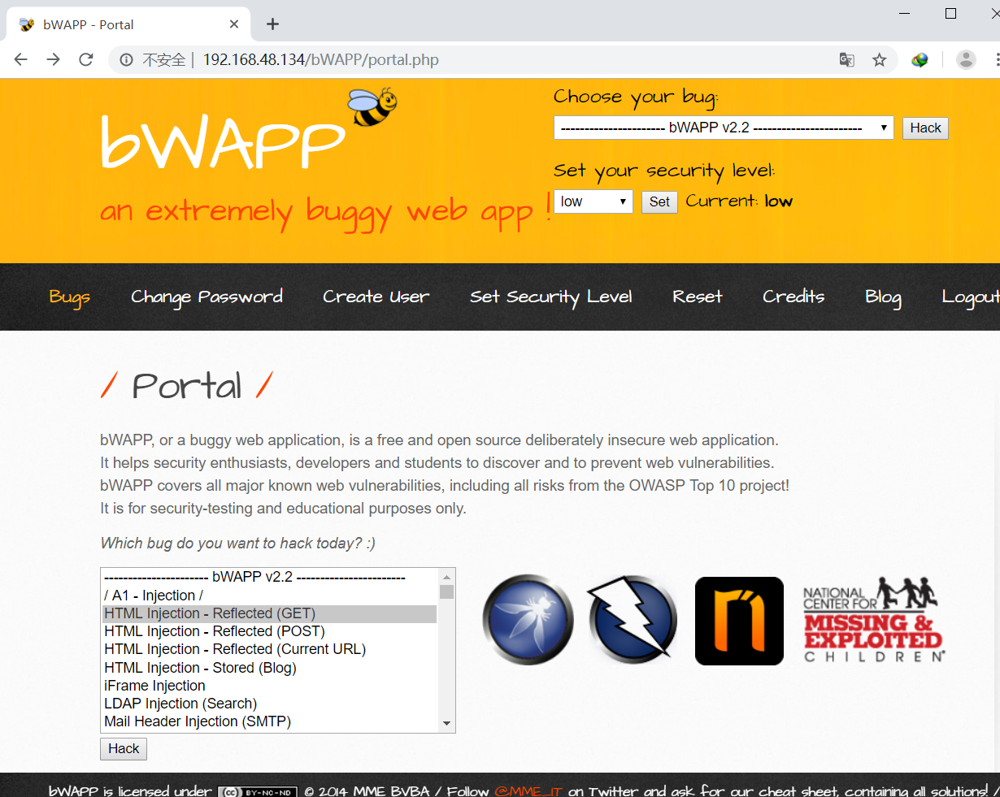


参考资料：

https://www.cnblogs.com/sunshineliulu/p/8991957.html

https://www.cnblogs.com/milton/p/6223813.html

https://www.php.net/manual/zh/install.unix.nginx.php

https://zhidao.baidu.com/question/550445087.html


#### 服务器加固

##### 一、账号与口令

1. 删除不必要用户

先查看所有用户

`cat /etc/passwd`

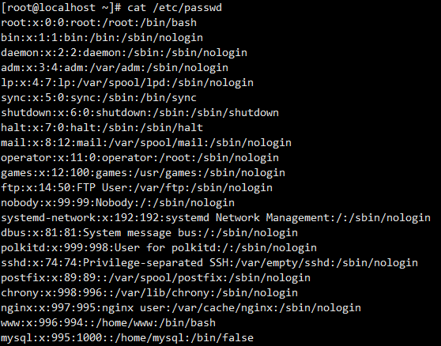

可删除的用户：adm、lp、sync、shutdown、halt、operator、games

```
userdel adm
...
```

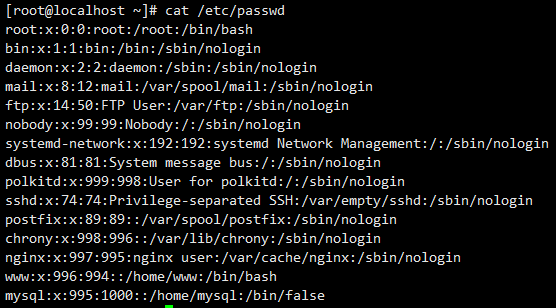

还有一个 www 用户需要禁止登录功能

`usermod -s /sbin/nologin www`


2 .检查特殊账号

使用命令 `awk -F: '($3==0)' /etc/passwd` 确认UID为零的账号只有 root

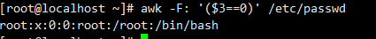


3 .添加口令策略

可以降低被猜解的可能性


ssh 登录连续输错三次密码，账号锁定五分钟

`vi /etc/pam.d/sshd`

加上 `auth required pam_tally2.so onerr=fail deny=3 unlock_time=300 even_deny_root root_unlock_time=10`

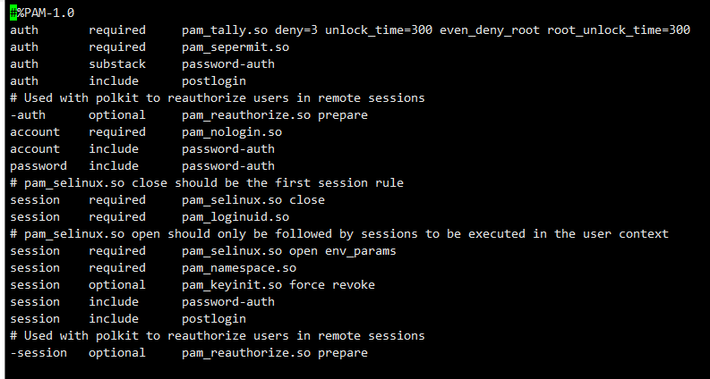

重启 sshd

`systemctl restart sshd`


测试效果

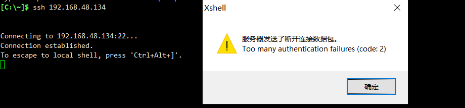

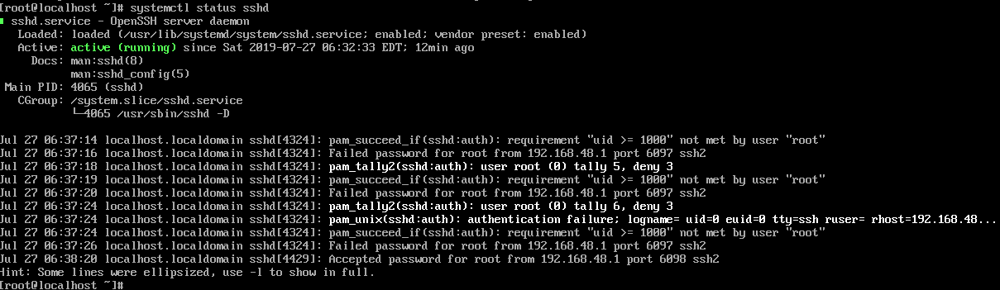


4 .防止 root 用户通过ssh登录

可以防止使用默认的 root 账号暴破

`vi /etc/ssh/sshd_config`

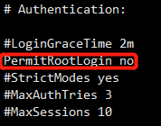


创建一个用户给自己登录

```
useradd droplet
passwd droplet
systemctl restart sshd   // 重启ssh生效
```

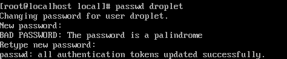


root 用户已无法登录

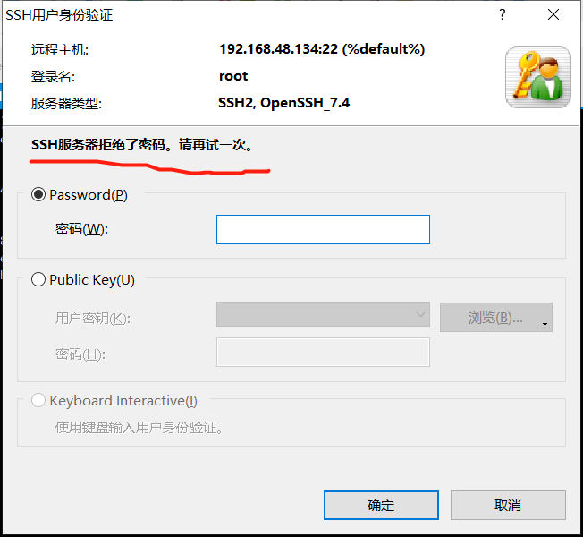


使用创建的用户登录

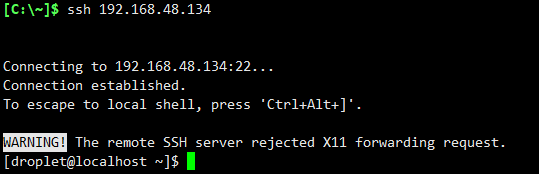


##### 二、防火墙配置

1. 查看防火墙状态

   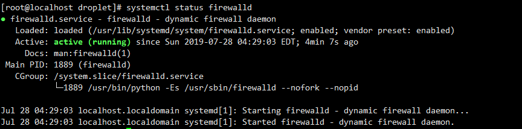

在防火墙开启的状态，默认是禁止所有端口被外部访问的，除了一个ssh服务

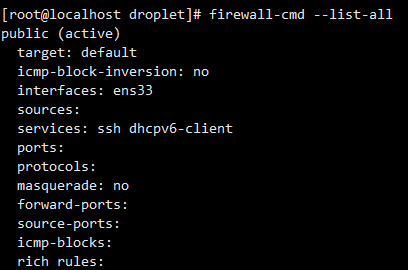


添加需要开放的端口

``` 
firewall-cmd --zone=public --add-port=80/tcp --permanent    // 永久生效
firewall-cmd --reload   // 重新载入
```


已经可以访问

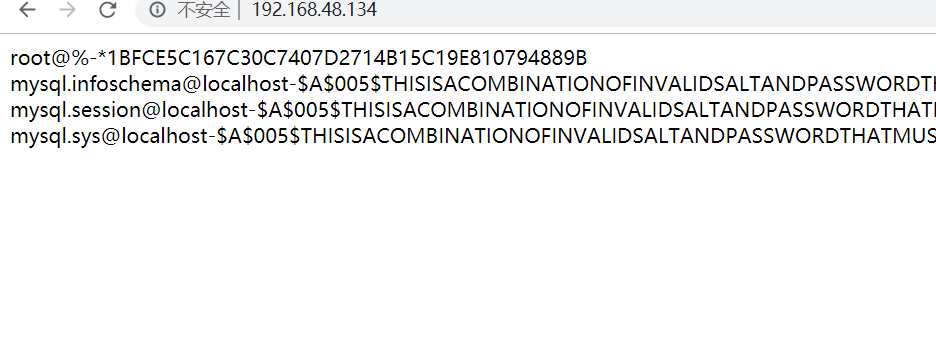

设置允许指定IP访问指定端口

```
firewall-cmd --permanent --add-rich-rule="rule family="ipv4" source address="192.168.48.1" port protocol="tcp" port="3306" accept"

firewall-cmd --reload
```


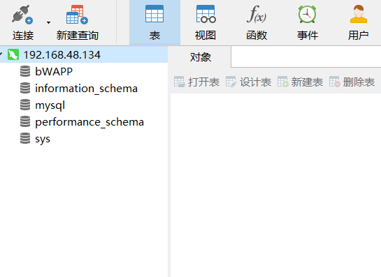

对于 22 端口连接的限制，先用 `firewall-cmd --remove-service --permanent` 移除ssh服务，再用以上同样的方法设置。

最后的规则为

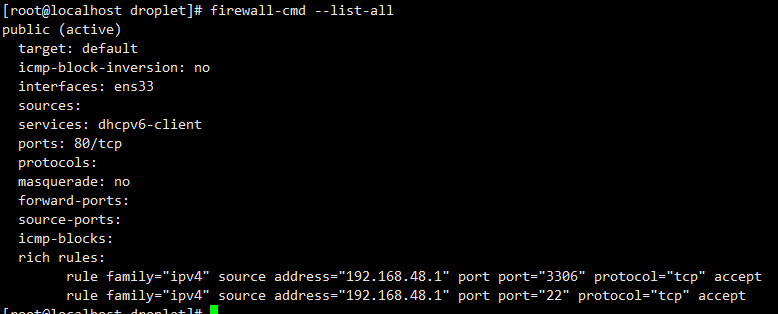


参考资料：

https://www.alibabacloud.com/help/zh/faq-detail/49809.htm

https://blog.csdn.net/qq_33168577/article/details/79585116

https://blog.xuite.net/tolarku/blog/363801991-CentOS+7+Firewalld+%E9%98%B2%E7%81%AB%E7%89%86%E8%AA%AA%E6%98%8E%E4%BB%8B%E7%B4%B9


##### 三、MySQL 安全

1、给指定用户授权

```
 create user 'droplet'@'localhost' identified by 'Qwer!234';
 create database dropletDB;
 grant select on dropletDB.* to droplet@'localhost' with grant option;
 flush privileges;
 //授予 select 权限，并且只能访问 dropletDB 这个数据库
```

退出，登录测试

```
mysql -udroplet -p
```

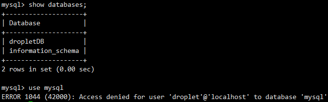


使用PHP测试

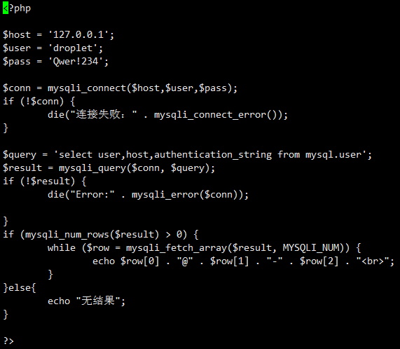

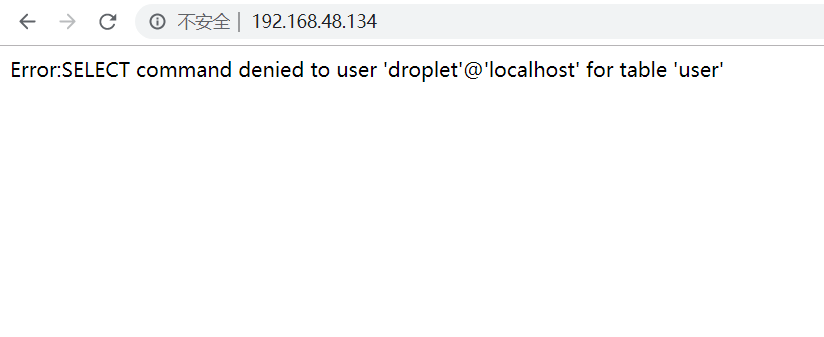

这样一来，即使出现SQL注入漏洞，也无法直接暴出 mysql.user 中的数据


参考资料：

https://www.alibabacloud.com/help/zh/faq-detail/49568.htm?spm=a2c63.q38357.a3.1.27aa182aemmtb5


##### 四、PHP 安全

`vi /etc/php.ini`

1、关闭危险函数

```
disable_function = system, exec, shell_exec, popen, phpinfo   // ...
```

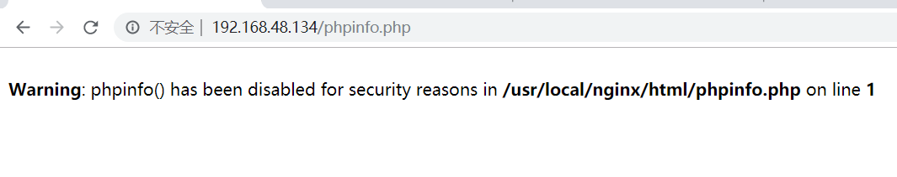

2、禁止显示错误信息

防止路径暴露

```
display_errors = Off
```

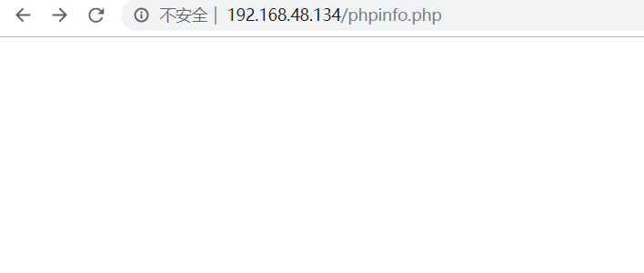

3、隐藏 X-Power-By 中的 PHP 版本号

可以避免入侵者利用特定版本的漏洞特性

```
expose_php = Off
```

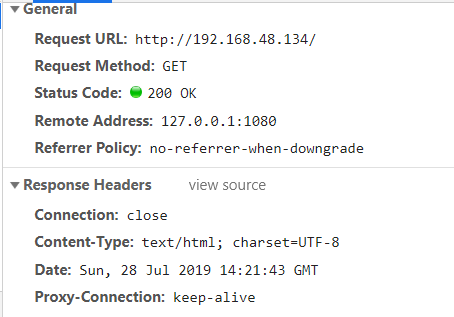


参考资料：

https://www.alibabacloud.com/help/zh/faq-detail/50218.htm?spm=a2c63.q38357.a3.1.42af6adb3j56D6


----

