Table of Contents
=================

  * [1 数据库读写文件](#1-数据库读写文件)
     * [1.1 读取文件](#11-读取文件)
           * [load_file()](#load_file)
               * [load data infile](#load-data-infile)
               * [system cat (Linux)](#system-cat-linux)
     * [1.2 写入文件](#12-写入文件)
           * [outfile](#outfile)
  * [2 数据库系统表学习](#2-数据库系统表学习)
     * [2.1 介绍](#21-介绍)
        * [2.1.1 information_schema](#211-information_schema)
        * [2.1.2 mysql](#212-mysql)
        * [2.1.3 performance_schema](#213-performance_schema)
     * [2.2 查询信息](#22-查询信息)
        * [2.2.1 查询数据库](#221-查询数据库)
        * [2.2.2 查询数据表](#222-查询数据表)
        * [2.2.3 查询列名](#223-查询列名)
        * [2.2.4 查询字段值](#224-查询字段值)
  * [3 破解hash](#3-破解hash)
  * [参考资料](#参考资料)

----

## 1 数据库读写文件

读写文件需要有两个前提：

1. 当前用户拥有 FILE 权限
2. secure_file_priv 变量的值不为 NULL

查看变量与权限：

```mysql
show global variables like 'secure_file_priv';
```

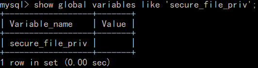 

```mysql
select user();
select * from mysql.user where user='root'\G;
```

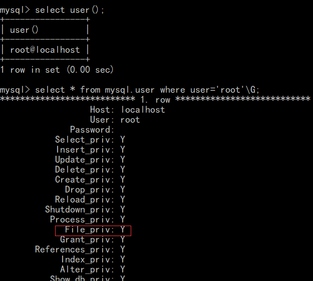 

或者：

```mysql
show grants for root@localhost;
```

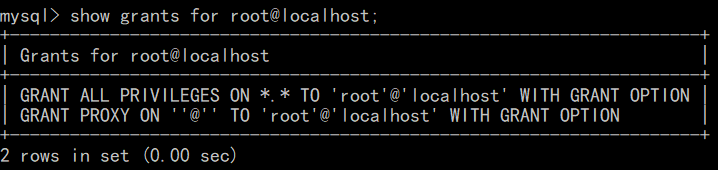 

当前是 root 用户，具有所有权限。

### 1.1 读取文件

从 MySQL 读取文件的方法大致有三种：

1. load_file()

2. load data infile()

3. system cat （适用于Linux）

##### load_file()

```mysql
select load_file('C:/test.txt');
```

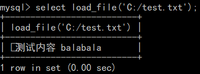 

##### load data infile

```mysql
create table week3(content text);
load data infile 'C:/test.txt' into table week3(content);
select * from week3;
```

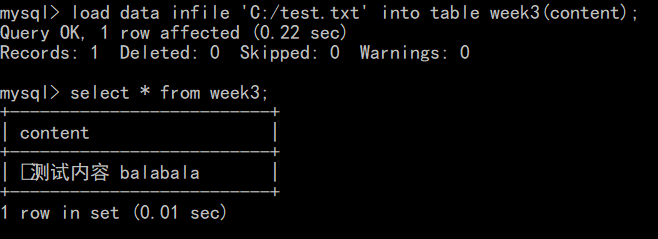 

##### system cat (Linux)

```mysql
system cat /etc/passwd
```

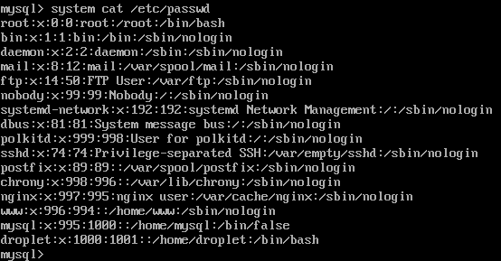 

### 1.2 写入文件

##### outfile

将数据表内容写入文件

```mysql
select * into outfile 'C:/user.txt' fields terminated by ',' lines terminated by '\n' from mysql.user;
```

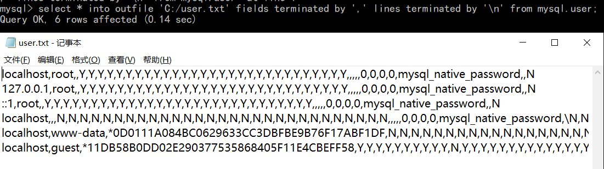 

将任意字符串写入文件

```mysql
select 'balabala' into outfile 'C:/bl.txt';
```

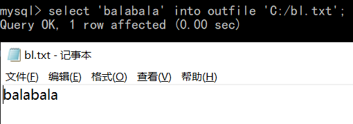 

----

## 2 数据库系统表学习

### 2.1 介绍

MySQL 5.6 自带有4个数据库：

1. information_schema
2. mysql
3. performance_schema
4. test

其中 test 为安装时创建的测试的空数据库，可以删除。

#### 2.1.1 information_schema

该库提供各个数据库的信息，包括库名、表名、列名与数据类型、访问权限等。

三个主要数据表说明：

**SCHEMATA**：提供所有数据库的库名、字符集等信息，`show databases;`的结果取之于此表。

**TABLES**：提供数据库中的表的信息，包括表名、属于哪个库、创建时间、字符集等，

​	`show tables from 库名;`的结果取之于此表。

**COLUMNS**：提供数据表中列的信息，包括列名、属于哪个表、属于哪个库等，

​	`show columns from 库名.表名;` 的结果取之于此表。

#### 2.1.2 mysql

主要负责存储数据库的用户、权限设置、关键字等 mysql 自己需要使用的控制和管理信息。

#### 2.1.3 performance_schema

主要用于收集数据库服务器性能参数，并且库里表的存储引擎均为 PERFORMANCE_SCHEMA，而用户是不能创建存储引擎为 PERFORMANCE_SCHEMA 的表。

performance_schema 提供以下功能：

1. 提供进程等待的详细信息，包括锁、互斥变量、文件信息；
2. 保存历史的事件汇总信息，为提供MySQL服务器性能做出详细的判断；
3. 对于新增和删除监控事件点都非常容易，并可以随意改变mysql服务器的监控周期，例如（CYCLE、MICROSECOND）。

### 2.2 查询信息

#### 2.2.1 查询数据库

```mysql
select schema_name from information_schema.schemata;
```

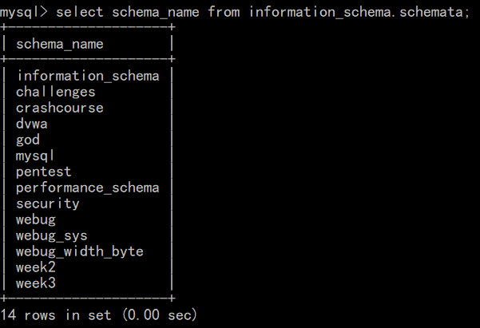 

在注入中，可以使用 LIMIT 属性设定返回记录数。

#### 2.2.2 查询数据表

```mysql
select table_name from information_schema.tables where table_schema='dvwa';
```

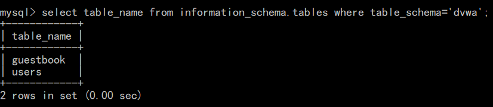

#### 2.2.3 查询列名


```mysql
select column_name from information_schema.columns where table_schema='dvwa' and table_name='users';
```

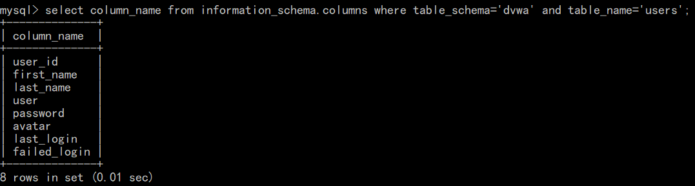 

#### 2.2.4 查询字段值

```mysql
 select user,password from dvwa.users;
```

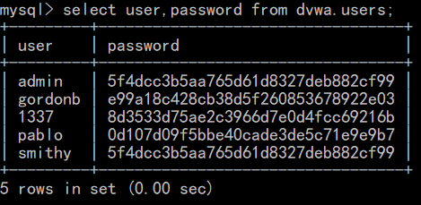 

----

## 3 破解hash

```
hashcat64.exe -a 0 5f4dcc3b5aa765d61d8327deb882cf99 example.dict
```

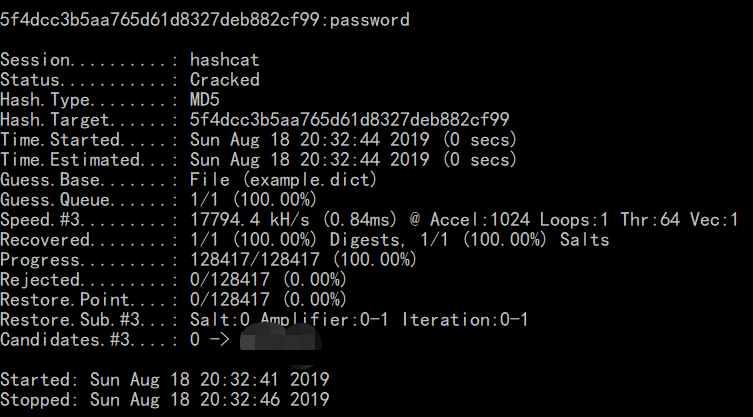

----

## 参考资料 

> [MySQL 自带库详解]https://www.cnblogs.com/clschao/articles/9928223.html
>
> [MySQL 几种读取文件的方法]https://www.cnblogs.com/c1e4r/articles/8618692.html
>
> [ SELECT ... INTO Syntax]https://dev.mysql.com/doc/refman/8.0/en/load-data.html
>
> [Hashcat 密码破解攻略]https://www.freebuf.com/sectool/164507.html
